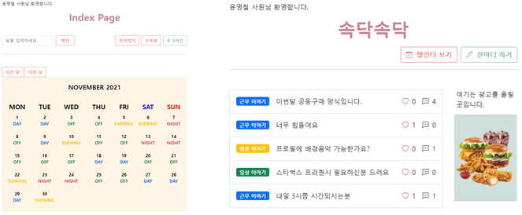

# 간호사 업무 보조 프로젝트

[](https://github.com/ycyoondev/JORLDY/blob/master/LICENSE)

병동 간호사들은 데이/이브닝/나이트 **3교대 업무**를 합니다. 병동의 수간호사 혹은 책임 간호사가 일정 주기로 근무표(듀티표)를 작성하며, **표에 따라서 근무를 수행**합니다. 근무표를 짤 때 능숙한 간호사와 미숙한 간호사를 적절하게 조합해야하며, 공정성과 개인의 일정을 고려해야 합니다.

이러한 근무표 작성은 고려할 사항이 많아 **수정할 때마다 많은 시간을 요구**합니다. 또한, 근무 인원에 문제가 발생할 때 빠른 수정이 불가능하다는 단점이 있습니다. 따라서 **관리 SW 개발이 요구되며 아직 배포된 서비스는 없는 상황**입니다.

## ❗ Thumbnails




## ⬇️ Installation

```
 $ git clone https://github.com/ycyoondev/nurse-duty.git
 $ cd nurse-duty
 $ pip install -r requirements.txt
```

**To use Virtual Environments**

(customize if necessary)

```
 $ cd nurse-duty
 $ python -m venv venv
 $ source venv/Scripts/activate/
 $ pip install -r requirements.txt
```


## 🚀 Getting started

```
$ python manage.py migrate
$ python manage.py runserver
```


## 👥 Contributors

- [ycyoondev](https://github.com/ycyoondev) 

- [all-eviate](https://github.com/all-eviate) 

- [2dend0713](https://github.com/2dend0713) 

- [zoyul](https://github.com/zoyul)


## ©️ License

[Apache License 2.0](https://github.com/ycyoondev/JORLDY/blob/master/LICENSE.md)

